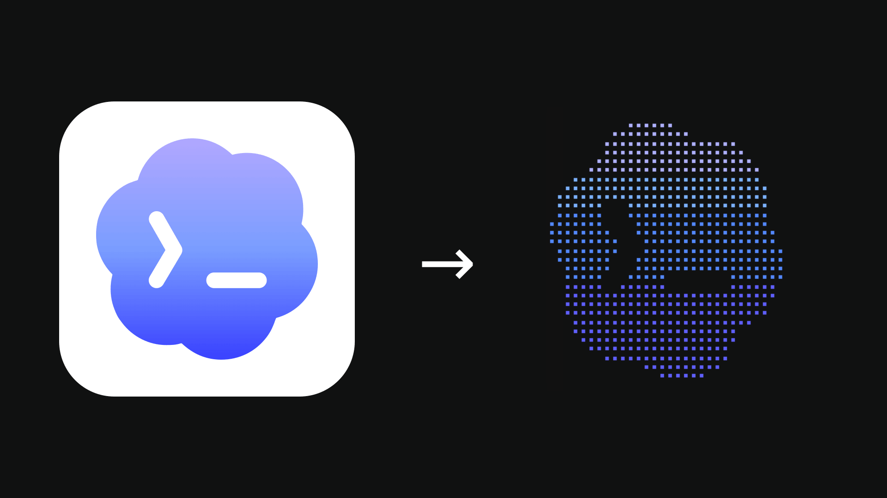

# blumdot

Render images as monochrome Unicode braille art on the command line.

`blumdot` reads a local image or URL, packs every 2×4 pixel block into a single
braille code point (`U+2800`–`U+28FF`), and prints the result. Raster formats
are decoded via [`image`](https://crates.io/crates/image); SVG inputs are
rasterized through [`resvg`](https://crates.io/crates/resvg) before sampling.



## Install

From source:

```sh
cargo install --path .
```

Or run it directly from the workspace:

```sh
cargo run --release -- <input> [options]
```

## Usage

```
blumdot <input> [--width N] [--threshold N] [--invert] [--alpha-cutoff N]
```

`<input>` is either a local image path or an `http(s)://` URL. Remote responses
are capped at 10 MiB.

| Flag                | Default | Description                                                 |
| ------------------- | ------- | ----------------------------------------------------------- |
| `-w`, `--width`     | `40`    | Output width in braille cells (each cell is 2 pixels wide). |
| `-t`, `--threshold` | `180`   | Luminance below this value becomes ink.                     |
| `--invert`          | off     | Treat light pixels as ink instead of dark ones.             |
| `--alpha-cutoff`    | `16`    | Alpha values below this are treated as blank.               |

Examples:

```sh
blumdot logo.png --width 60
blumdot https://example.com/icon.svg --invert
blumdot photo.jpg --threshold 128 --width 80
```

## Library

`blumdot` is also a library. The main entry points are `render_source` (load
and render in one step) and `render_image` (render an in-memory
`image::DynamicImage`):

```rust
use blumdot::{InputSource, RenderOptions, render_source};

let art = render_source(
    InputSource::parse("logo.png"),
    RenderOptions::default().with_width(60),
)?;
println!("{art}");
```

## Trivia

The name comes from a jingle in a 90s Brazilian appliances ad that went
"bloom bop" — when I was reaching for a word to pair with "dot", that jingle
came straight to mind. You can hear it
[here, at 0:27](https://youtu.be/QhPK0CE_6uw?si=bxDLsp7rRqXUoHJz&t=27).

## Development

```sh
cargo test
cargo run -- <input>
```
